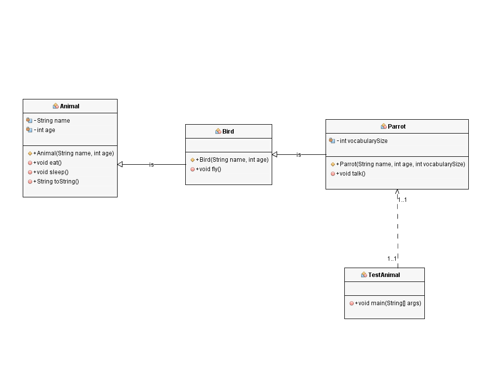

# 🦜 Практична робота "Реалізація успадкування" 🦜

## 📋 Опис завдання
У цій практичній роботі реалізовано концепцію успадкування в мові Java на прикладі **папуги** - яскравої та розумної птахи з унікальними здібностями. Метою роботи є демонстрація механізму успадкування та перевизначення методів у об'єктно-орієнтованому програмуванні.

## Моя модель тварини: Папуга (Parrot) 🦜


### 🔄 Ієрархія класів



## 📝 Опис реалізації

### Структура проекту
```
src/
├── domain/
│   ├── Animal.java    // Базовий клас для всіх тварин
│   ├── Bird.java      // Клас, що представляє птахів
│   └── Parrot.java    // Клас, що представляє папугу
└── test/
    └── TestAnimal.java // Тестовий клас для демонстрації роботи
```

### Опис класів

#### 🐾 Animal.java
Базовий клас, який містить спільні для всіх тварин атрибути та поведінку:
- Атрибути: `name` (ім'я), `age` (вік)
- Методи: `eat()` (їсти), `sleep()` (спати)

```java
public class Animal {
    protected String name;
    protected int age;
    
    // Конструктор та методи
    // ...
}
```

#### 🐦 Bird.java
Клас, що розширює `Animal` та додає специфічну для птахів поведінку:
- Новий метод: `fly()` (літати)

```java
public class Bird extends Animal {
    // Конструктор і методи
    // ...
    
    public void fly() {
        System.out.println(name + " is flying.");
    }
}
```

#### 🦜 Parrot.java
Клас, що розширює `Bird` і додає специфічні для папуги атрибути та поведінку:
- Новий атрибут: `vocabularySize` (розмір словникового запасу)
- Новий метод: `talk()` (розмовляти)

```java
public class Parrot extends Bird {
    private int vocabularySize;
    
    // Конструктор і методи
    // ...
    
    public void talk() {
        System.out.println(name + " is talking.");
    }
}
```

## 🧪 Тестовий клас

У класі `TestAnimal` створюється об'єкт папуги на ім'я "Polly" віком 3 роки з словниковим запасом у 50 слів та демонструється його функціональність:

```java
public static void main(String[] args) {
    Parrot parrot = new Parrot("Polly", 3, 50);
    
    System.out.println(parrot.toString());
    System.out.println();
    
    System.out.println("Actions:");
    parrot.eat();     // Метод від Animal
    parrot.sleep();   // Метод від Animal
    parrot.fly();     // Метод від Bird
    parrot.talk();    // Метод Parrot
}
```

## 💻 Результати виконання

При запуску тестового класу можна побачити наступний вивід:
```
Animal:
Name: Polly
Age: 3
Parrot:
Vocabulary Size: 50

Actions:
Polly is eating.
Polly is sleeping.
Polly is flying.
Polly is talking.
```

## 📸 Скріншот виконання

Нижче наведено скріншот виконання програми в середовищі розробки:


## 📚 Висновки

В рамках цієї практичної роботи було успішно реалізовано концепцію успадкування в Java:
- Створено ієрархію класів `Animal` → `Bird` → `Parrot`
- Продемонстровано перевизначення методів (метод `toString()`)
- Реалізовано розширення функціональності базових класів у похідних
- Продемонстровано використання захищених полів (`protected`) для доступу до них у похідних класах

Ця модель дозволяє легко додавати нові типи птахів або інших тварин шляхом розширення відповідних базових класів.

---

> 💡 **Виконав**: [Тесленко Павло]
> 💡 **Група**: 35 
> 📅 **Дата**: 28.02.2025
